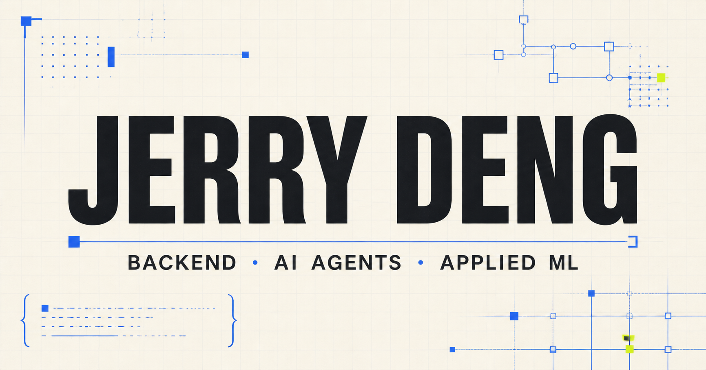

  

## Hi, I’m Jerry.

I’m a Computer Science student at the University of Michigan building reliable
backend systems, AI agents, and applied machine learning products.

Most of my work follows the same pattern: start with messy real-world data,
make the system boundaries explicit, and build something that can be measured,
debugged, and trusted.

### Selected work

| Project | What it demonstrates | Stack |
|---|---|---|
| **[StockRadar](https://github.com/JerryDengdmr/stock-radar-case-study)** | Always-on service, staged decision funnel, state reconciliation, failure recovery, and forward evaluation across 390+ live streams | Python · asyncio · SQLite · LLM APIs |
| **[Agent Reliability Lab](https://github.com/JerryDengdmr/agent-reliability-lab)** | Deterministic gates, failure injection, tool-trace assertions, and regression testing for probabilistic systems | Python · agent evals · CI |
| **[Degree Path Planner](https://github.com/JerryDengdmr/umich-degree-path-planner)** | Privacy-first transcript processing, explainable requirement auditing, value scoring, and availability-aware constraints | Python · TypeScript contracts · REST data |

### Current interests

- Backend and distributed-system fundamentals
- AI agent reliability, evaluation, and tool boundaries
- Applied ML systems where data quality matters more than model novelty
- Interfaces that turn complex system state into clear decisions

### A few measured outcomes

- Reduced one AI-assisted pipeline from roughly **20 minutes to 4 minutes**
- Built and evaluated a pathology segmentation pipeline across **~70k tiles**
- Reached **0.967 held-out Dice** under a two-second inference constraint
- Cut an enterprise reporting workflow’s update time by approximately **3×**

### Connect

[Portfolio](https://jerrydengdmr.github.io) ·
[LinkedIn](https://www.linkedin.com/in/jerry-deng-b52245290) ·
[Email](mailto:jerrydmr@umich.edu)

Some production and internship code remains private to protect live
credentials, personal data, and employer intellectual property. Public case
studies document the engineering decisions without crossing those boundaries.
